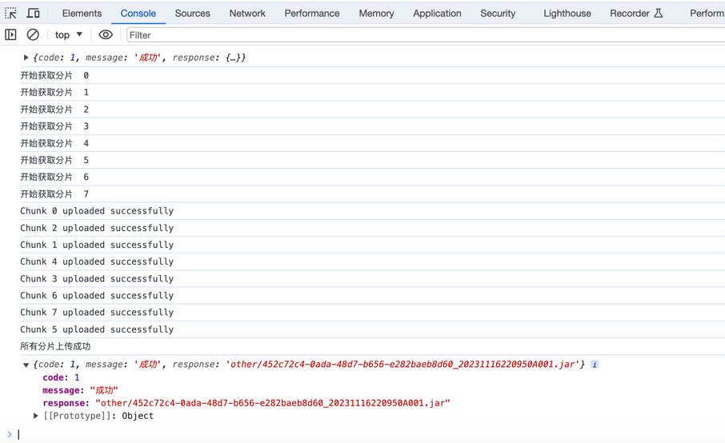

### 项目名称
项目基于 MinioTemplate 类实现了简便的分片上传文件功能，支持秒传和断点续传。开箱即用。
本项目断点续传支持24小时内有效，超过24小时后，上传信息会被清除，需要重新上传。

#### 使用方法
  配置minio信息 application.yml
      地址、密钥、桶、分片大小
  配置redis 、 mysql
  默认根据文件类型创建文件夹，可在FileUploadUtils自行配置
  

#### 分片上传流程

1. 获取分片初始化信息 
		初始化上传流程，获取分片上传所需的信息。

``` json
请求体
{
"filename": "文件名称",
"md5": "文件内容的MD5值",
"size": "文件大小"
}
```

``` json
返回值:
{
"msg": "操作成功",
"code": 1,
"data": {
"uploadId": "ZThkOTQ0Y2MtMGU1YS00N2Q5LTlkNzgtZTYzOTE2N2Y3ODcwLmNhOWNlN2ZjLWVmNjUtNGZiNi1hMTFmLThmNGUwNjk3M2Q0MA",
"uploadUrlList": [
"/api/file/multipart/chunkUpload?uploadId=ZThkOTQ0Y2MtMGU1YS00N2Q5LTlkNzgtZTYzOTE2N2Y3ODcwLmNhOWNlN2ZjLWVmNjUtNGZiNi1hMTFmLThmNGUwNjk3M2Q0MA&chunk=chunk_0",
"/api/file/multipart/chunkUpload?uploadId=ZThkOTQ0Y2MtMGU1YS00N2Q5LTlkNzgtZTYzOTE2N2Y3ODcwLmNhOWNlN2ZjLWVmNjUtNGZiNi1hMTFmLThmNGUwNjk3M2Q0MA&chunk=chunk_1",
"/api/file/multipart/chunkUpload?uploadId=ZThkOTQ0Y2MtMGU1YS00N2Q5LTlkNzgtZTYzOTE2N2Y3ODcwLmNhOWNlN2ZjLWVmNjUtNGZiNi1hMTFmLThmNGUwNjk3M2Q0MA&chunk=chunk_2",
"/api/file/multipart/chunkUpload?uploadId=ZThkOTQ0Y2MtMGU1YS00N2Q5LTlkNzgtZTYzOTE2N2Y3ODcwLmNhOWNlN2ZjLWVmNjUtNGZiNi1hMTFmLThmNGUwNjk3M2Q0MA&chunk=chunk_3",
"/api/file/multipart/chunkUpload?uploadId=ZThkOTQ0Y2MtMGU1YS00N2Q5LTlkNzgtZTYzOTE2N2Y3ODcwLmNhOWNlN2ZjLWVmNjUtNGZiNi1hMTFmLThmNGUwNjk3M2Q0MA&chunk=chunk_4"
],
"partCount": 5,
"url": null
}
}
```


#### 2. 调用分片接口
   调用分片上传接口，将文件分片上传至服务器。
   http://localhost:8080/api/file/multipart/chunkUpload?uploadId=xxxxxx&chunk=chunk_0
   http://localhost:8080/api/file/multipart/chunkUpload?uploadId=xxxxxx&chunk=chunk_1
   http://localhost:8080/api/file/multipart/chunkUpload?uploadId=xxxxxx&chunk=chunk_2
   http://localhost:8080/api/file/multipart/chunkUpload?uploadId=xxxxxx&chunk=chunk_3
   http://localhost:8080/api/file/multipart/chunkUpload?uploadId=xxxxxx&chunk=chunk_4
#### 3. 合并分片

	合并上传完成的分片，生成最终文件。

```json
请求体:
   {
   "uploadId": "xxxxxx"
   }
```
 ``` json
  返回值:
 {
 "msg": "/video/91fc7d51-6caf-4d66-834e-165456f55975_20230210121947A001.mp4",
 "code": 1
 }
 ```


